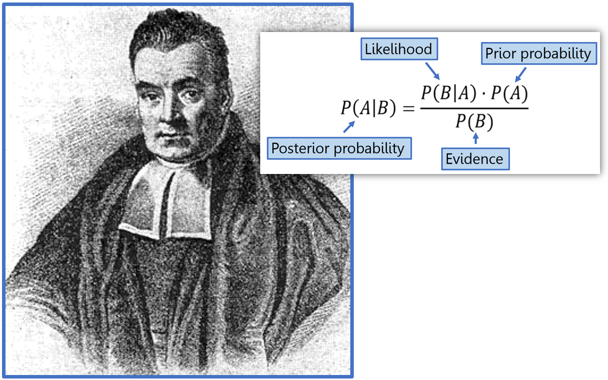
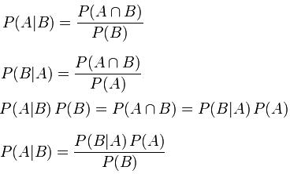

# Naive Bayes


*   Thomas Bayes (1701 – 1761) was an English 
    statistician and philosopher 
    
*   Bayes is known for formulating a specific 
    case of the theorem that bears his name: Bayes' 
    theorem.

* In machine learning, Naïve Bayes classifiers 
    are  a  family  of  simple  "probabilistic 
    classifiers" based  on applying Bayes' theorem 
    with strong (naïve) independence assumptions 
    between the features. 

````
    Possible k outcomes = {C1, C2, ..., Ck}

    i =  1, 2, ..., k

                   P(Ci) P(x | Ci)
    P(Ci | x) =  -------------------
                       P(x)
````                     
                     
* `P(A | B)` stands for "the conditional 
  probability of A given B", or "the 
  probability of A under the condition B", 
  i.e. the probability of some event A under 
  the assumption that the event B took place. 
  
* `P(A | B) = P (A and B) / P(B)`

* P(B) can not be ZERO since B has happened
    
* Conditional probability answers the question: 
  how does the probability of an event change 
  if we have extra information
  
* Independent Events: Events A and B are 
  independent whenever `P(A | B) = P(A)`. 

* Equivalently, events A and B are independent 
  whenever `P(B | A) = P(B)`

* When two events A and B are independent, 
  we can use the multiplication rule for independent 
  events : `P(A and B) = P(A) x P(B)`
------


------



------



------

## Probability, Conditional Probability: foundation for Naive Bayes

1. [Probability: Terminology and Examples](https://ocw.mit.edu/courses/mathematics/18-05-introduction-to-probability-and-statistics-spring-2014/class-slides/MIT18_05S14_class2slides.pdf)

2. [Lesson slides: Understand conditional probability using scenarios -- 8 slides](https://learnzillion.com/resources/10582/)

3. [Conditional Probability](https://www.mathsisfun.com/data/probability-events-conditional.html)

4. [Conditional Probability, Independence and Bayes’ Theorem](http://www-math.mit.edu/~dav/05.dir/class3-prep.pdf)

5. [Conditional Probability, Independence, Bayes’ Theorem -- MIT slides](https://ocw.mit.edu/courses/mathematics/18-05-introduction-to-probability-and-statistics-spring-2014/class-slides/MIT18_05S14_class3slides.pdf)

6. [Section 5.3 - Conditional Probability and Independence](https://www.gcsnc.com/site/handlers/filedownload.ashx?moduleinstanceid=66556&dataid=51958&FileName=5.3%20PowerPoint.pdf)
------

## Naive Bayes Videos

1. [An Introduction to Conditional Probability: 12 minutes video](https://www.youtube.com/watch?v=bgCMjHzXTXs)

2. [Naive Bayes Classifier With Example : 43 minutes](https://www.youtube.com/watch?v=l3dZ6ZNFjo0)

3. [Naive Bayes Classifier in Python : 30 minutes](https://www.youtube.com/watch?v=vz_xuxYS2PM) 

4. [Naive Bayes Classifier - Stanford University Course: 10 minutes](https://www.youtube.com/watch?v=6xBU74VWEuE)

5. [Introduction to Naive Bayes Theorem, ML Classification: 10 minutes](https://www.youtube.com/watch?v=sjUDlJfdnKM)

6. [Naive Bayes classifier: A friendly approach: 20 minutes](https://www.youtube.com/watch?v=Q8l0Vip5YUw)

------

## Naive Bayes -- Introduction

1. [Introduction to Naive Bayes -- slide 37 (pages)](http://web.iitd.ac.in/~bspanda/BY.pdf)

2. [Naive Bayes Classifier 37 (pages)](https://www.slideshare.net/EdurekaIN/naive-bayes-classifier-in-python-naive-bayes-algorithm-machine-learning-algorithm-edureka?qid=d457ea5b-9654-4212-819e-f4e1096407eb&v=&b=&from_search=2)

3. [Naive Bayesian (with example)](https://www.saedsayad.com/naive_bayesian.htm)
<!-- GOOD -- MP : make it lecture notes -->

4. [Naïve Bayes and Logistic Regression, by Tom M. Mitchell](http://www.cs.cmu.edu/~awm/15781/slides/NBayes-9-27-05.pdf)

5. [Naive Bayes Classification using Scikit-learn](https://www.datacamp.com/community/tutorials/naive-bayes-scikit-learn)
<!-- GOOD -- MP : make it lecture notes -->

6. [Naive Bayes Classifiers (Golf Example)](https://www.geeksforgeeks.org/naive-bayes-classifiers/)

7. [Naive Bayes Classifier From Scratch in Python](https://machinelearningmastery.com/naive-bayes-classifier-scratch-python/)

8. [Naive Bayes Tutorial for Machine Learning](https://machinelearningmastery.com/naive-bayes-tutorial-for-machine-learning/)

9. [Naive Bayes Classifier Explained Step by Step](https://www.globalsoftwaresupport.com/naive-bayes-classifier-explained-step-step/)

10. [How Naive Bayes Algorithm Works? (with example and full code)](https://www.machinelearningplus.com/predictive-modeling/how-naive-bayes-algorithm-works-with-example-and-full-code/)

11. [Python Machine Learning Tutorial: Naive Bayes Classifier](https://www.python-course.eu/naive_bayes_classifier_introduction.php)

<!-- work on this: https://towardsdatascience.com/all-about-naive-bayes-8e13cef044cf -->

12. [Naive Bayes Classifier: Learning Naive Bayes with Python](https://www.edureka.co/blog/naive-bayes-tutorial/)
<!-- GOOD -- MP : make it lecture notes -->

13. [Pure Python Solution: An Introduction to Naïve Bayes Classifier](https://towardsdatascience.com/introduction-to-naïve-bayes-classifier-fa59e3e24aaf)
<!-- GOOD -- MP : make it lecture notes -->

------

## Naive Bayes Deep Understandings

1. [In Depth: Naive Bayes Classification](https://jakevdp.github.io/PythonDataScienceHandbook/05.05-naive-bayes.html)

2. [How to Develop a Naive Bayes Classifier from Scratch in Python: by Jason Brownlee](https://machinelearningmastery.com/classification-as-conditional-probability-and-the-naive-bayes-algorithm/)

<!-- https://www.kaggle.com/janiobachmann/bank-marketing-dataset#bank.csv bank.csv -->

------

# Spark-ML for Naive Bayes

1. [PySpark + Naive Bayes: worked example](https://runawayhorse001.github.io/LearningApacheSpark/classification.html#naive-bayes-classification)

2. [Naive Bayes Classifier - ML Pipelines](https://databricks-prod-cloudfront.cloud.databricks.com/public/4027ec902e239c93eaaa8714f173bcfc/3741049972324885/3783546674231736/4413065072037724/latest.html)

3. [How to implement Naive Bayes with Spark MLlib](https://hub.packtpub.com/machine-learning-algorithms-naive-bayes-with-spark-mllib/)
<!--
Multi-Class Text Classification with PySpark
https://towardsdatascience.com/multi-class-text-classification-with-pyspark-7d78d022ed35
https://github.com/susanli2016/Machine-Learning-with-Python/blob/master/SF_Crime_Text_Classification_PySpark.ipynb

Data: San Francisco Crime Classification
https://www.kaggle.com/c/sf-crime/data
-->

4. Multi-Class Text Classification with PySpark
	* [Multi-Class Text Classification with PySpark -- blog](https://towardsdatascience.com/multi-class-text-classification-with-pyspark-7d78d022ed35)
	* [PySpark solutions: Logistic Regression, Naive Bayes](https://github.com/susanli2016/Machine-Learning-with-Python/blob/master/SF_Crime_Text_Classification_PySpark.ipynb)
	* [San Francisco Crime Classification Data download](https://www.kaggle.com/c/sf-crime/data)
	
5. [Pyspark – Classification with Naive Bayes](https://praveenbezawada.com/2018/04/28/pyspark-classification-with-naive-bayes/)
